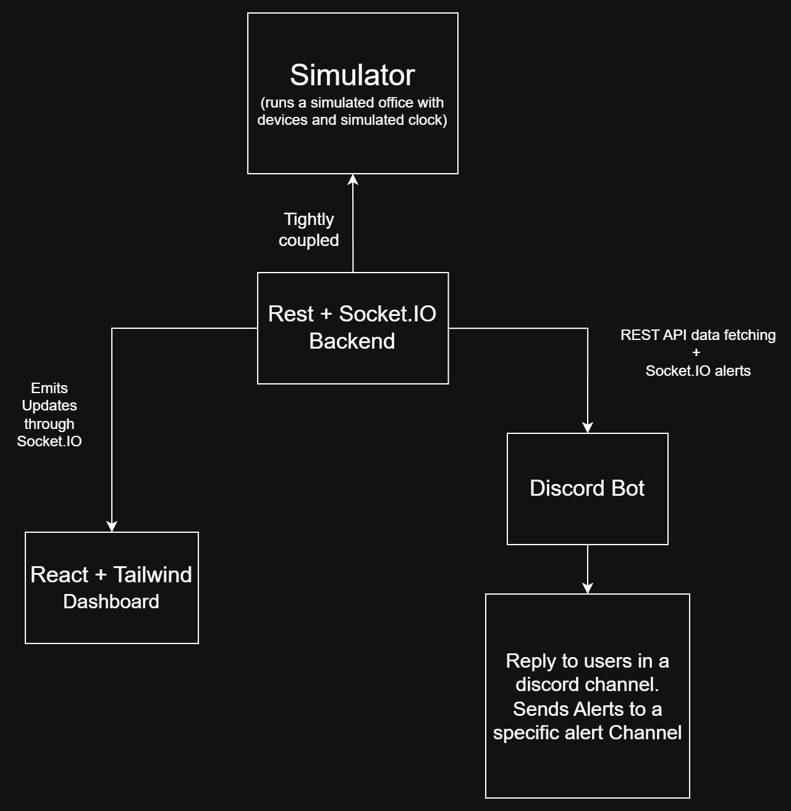

# Smart Office Energy Monitoring System

<p align="center">
  
</p>

A real-time Smart Office Energy Monitoring System built for the **IUT Hackathon**.

The project simulates an office environment, monitors electrical devices in real time, visualizes the office through a live dashboard, allows interaction through a Discord bot powered by Google's Gemini API, and proactively notifies users when devices remain active after office hours.

---

# Features

- 🏢 Office simulator with virtual office clock
- ⚡ Live energy monitoring
- 📊 React + Tailwind dashboard
- 🤖 Discord bot assistant
- 🧠 Google Gemini powered summaries
- 🔔 Automatic after-hours Discord alerts
- 📡 Socket.IO real-time communication
- 🌐 REST API
- 🏠 Room-wise power monitoring

---

# Project Structure

```text
IUT-HACKATHON/
│
├── backend/
│   ├── simulator/
│   ├── llm.js
│   ├── index.js
│   └── ...
│
├── bot/
│   ├── api/
│   ├── socket.js
│   ├── index.js
│   └── ...
│
├── dashboard/
│   ├── src/
│   ├── public/
│   └── ...
│
└── README.md
```

---

# Tech Stack

## Backend

- Node.js
- Express.js
- Socket.IO
- Google Gemini API

## Dashboard

- React
- Tailwind CSS
- Vite
- Socket.IO Client

## Discord Bot

- Discord.js
- Axios
- Socket.IO Client

---

# Installation

Clone the repository.

---

## Backend

```bash
cd backend
npm install
```

Create a `.env` file inside **backend/**

```env
PORT=3000

GEMINI_API_KEY=YOUR_GEMINI_API_KEY
```

---

## Discord Bot

```bash
cd bot
npm install
```

Create a `.env` file inside **bot/**

```env
DISCORD_TOKEN=YOUR_DISCORD_BOT_TOKEN

BACKEND_URL=http://localhost:3000

ALERT_CHANNEL_ID=YOUR_DISCORD_CHANNEL_ID
```

---

## Dashboard

```bash
cd dashboard
npm install
```

Create a `.env` file inside **dashboard/**

```env
VITE_BACKEND_URL=http://localhost:3000
```

---

# Running the Project

Open **three terminals**.

---

## Terminal 1

```bash
cd backend
npm run dev
```

Starts:

- Office Simulator
- REST API
- Socket.IO Server

---

## Terminal 2

```bash
cd bot
npm run dev
```

Starts:

- Discord Bot
- Socket.IO Client

---

## Terminal 3

```bash
cd dashboard
npm run dev
```

Starts:

- React Dashboard

---

# System Architecture

The application consists of four major components.

### Office Simulator

Runs a virtual office environment.

Responsibilities:

- Simulates rooms
- Simulates devices
- Simulates office clock
- Randomly changes device states
- Generates alerts after office hours

---

### Backend

Acts as the central communication hub.

Responsibilities:

- REST API
- Socket.IO server
- LLM integration
- Simulator management
- Broadcasts simulator updates
- Broadcasts alert events

---

### Dashboard

Displays office state in real time.

Features:

- Live room status
- Room-wise energy consumption
- Device status
- Simulated office clock
- After-hours alert panel

---

### Discord Bot

Allows users to monitor the office directly from Discord.

Features:

- Office status summaries
- Power usage
- Room information
- Natural language responses
- Automatic after-hours notifications

---

# Communication

## Dashboard

Uses:

- REST (initial requests)
- Socket.IO (live updates)

Receives:

```
office:update
```

---

## Discord Bot

Uses:

- REST API for commands
- Socket.IO for proactive alerts

Receives:

```
after-hours-alert
```

---

# Discord Commands

```
!help

!status

!usage

!room drawing

!room work1

!room work2
```

---

# REST API

## Office

```
GET /api/state
```

Returns current office state.

---

```
GET /api/usage
```

Returns overall office power usage.

---

```
GET /api/alerts
```

Returns active alerts.

---

## Discord Endpoints

```
GET /api/discord/status
```

---

```
GET /api/discord/usage
```

---

```
GET /api/discord/room/:room
```

---

# Socket.IO Events

## Backend → Dashboard

```
office:update
```

Broadcasts simulator state whenever the office changes.

---

## Backend → Discord Bot

```
after-hours-alert
```

Sent periodically after office hours while devices remain active.

---

# Office Simulation

The simulator models three rooms.

- Drawing Room
- Work Room 1
- Work Room 2

Each room contains:

- Ceiling Fans
- Lights

Each device has:

- Name
- Room
- Status
- Wattage
- Last changed time

---

# Simulated Clock

The simulator uses a virtual office clock.

Office Hours:

```
09:00 AM
↓

05:00 PM
```

The clock advances automatically every simulator tick.

---

# Alerts

After **5:00 PM**, any device that remains ON generates an alert.

Alerts are:

- Displayed on the dashboard
- Sent automatically to Discord

---

# Authors

Developed for the **IUT Hackathon**.
